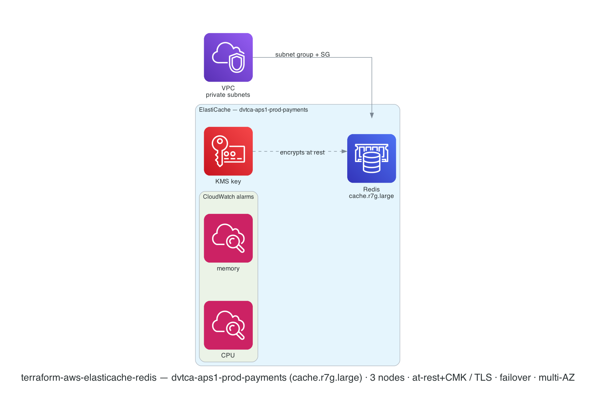

# terraform-aws-elasticache-redis

[](https://github.com/devotica-labs/terraform-aws-elasticache-redis/actions/workflows/ci.yml)
[](https://github.com/devotica-labs/terraform-aws-elasticache-redis/actions/workflows/release.yml)
[](LICENSE)

Production-grade Amazon **ElastiCache for Redis** module for the Devotica catalog. Provisions a highly-available replication group in private subnets — encrypted at rest and in transit, with automatic failover, Multi-AZ, automated backups, a dedicated security group, parameter group, and optional CloudWatch alarms.

This module is written in the Devotica house style: native (no external naming/security-group modules), validated inputs, plan-only unit + contract tests, terraform-docs auto-update, central reusable CI from `devotica-labs/terraform-shared-config`, conftest policies from `devotica-labs/terraform-policies`, and signed releases with CycloneDX SBOMs.

<!-- BEGIN_ARCH -->



<sub>Generated by `.github/workflows/architecture-diagram.yml` on every push to main. Do not edit the image by hand — change the Terraform code in `examples/complete/` and the bot will regenerate it.</sub>

<!-- END_ARCH -->

## Scope

| Surface | Covered |
|---|---|
| Redis replication group (single shard, N replicas) | ✅ |
| Redis Cluster mode (sharded) | ✅ (opt-in) |
| At-rest encryption (AWS-managed or CMK) | ✅ (default on) |
| In-transit encryption (TLS) | ✅ (default on) |
| AUTH token / RBAC user groups | ✅ |
| Automatic failover + Multi-AZ | ✅ (default on) |
| Automated snapshots + final snapshot | ✅ |
| Dedicated security group (or BYO) | ✅ |
| Parameter group (create or BYO) | ✅ |
| Slow-log / engine-log delivery | ✅ |
| CPU + memory CloudWatch alarms | ✅ (opt-in) |
| Serverless ElastiCache | ❌ (planned) |
| Global datastore (cross-region) | ❌ (planned) |
| Route53 CNAME helper | ❌ (publish from the consumer) |
| Memcached | ❌ (Redis/Valkey only) |

## Quick start

Resource names compose from `namespace` / `environment` / `stage` / `name` (joined by `-`), e.g. `dvtca-prod-payments`.

```hcl
module "redis" {
  source  = "devotica-labs/elasticache-redis/aws"
  version = "~> 0.1"

  namespace = "dvtca"
  stage     = "prod"
  name      = "sessions"

  vpc_id     = module.vpc.vpc_id
  subnet_ids = module.vpc.private_subnet_ids

  allowed_security_group_ids = [module.app.security_group_id]

  # Centralise the at-rest key (optional — omit for the AWS-managed key):
  kms_key_id = module.kms.key_arn

  tags = {
    Environment = "production"
    Project     = "sessions"
    Owner       = "platform@example.com"
    CostCenter  = "PLATFORM"
    ManagedBy   = "Terraform"
  }
}
```

See [`examples/complete`](examples/complete/main.tf) for the full surface (CMK, RBAC, parameters, log delivery, alarms, larger node types).

## Defaults that matter

Each hardened default is annotated `# Devotica fintech default` in [`variables.tf`](variables.tf):

- **`at_rest_encryption_enabled = true`** and **`transit_encryption_enabled = true`** — data is encrypted at rest and over the wire. Pass `kms_key_id` for a customer-managed key; clients must connect over TLS.
- **`cluster_size = 2` + `automatic_failover_enabled = true` + `multi_az_enabled = true`** — a primary plus a replica in another AZ, with automatic promotion. These three move together: failover needs a replica, Multi-AZ needs failover.
- **`snapshot_retention_limit = 7`** — automated daily backups retained for a week (upstream/AWS default is 0 = no backups).
- **`node_type = "cache.t4g.micro"`** — Graviton, and a class that actually supports encryption + failover (t1/t2 don't).
- **`apply_immediately = false`** — changes land in the maintenance window, not mid-traffic.
- **`auto_minor_version_upgrade = true`** — pick up patch-level engine fixes automatically.
- **Security group** admits only the configured `allowed_security_group_ids` / `allowed_cidr_blocks` on `port` — never `0.0.0.0/0` inbound.

A `check` block warns if you enable failover without a replica, Multi-AZ without failover, or an AUTH token without transit encryption.

## How this fits the Devotica catalog

```
terraform-aws-vpc            terraform-aws-kms (optional CMK)
   │ private subnet IDs         │ at-rest encryption key
   ▼                            ▼
                terraform-aws-elasticache-redis
                          │ endpoint + security group
                          ▼
         app tier (terraform-aws-ecs-fargate / eks workloads)
         — allow the app SG in via allowed_security_group_ids
```

Run it in the VPC's **private** subnets, reference a `terraform-aws-kms` key for at-rest encryption, and allow your application security group in on the Redis port. Apps read `endpoint_address` (and `reader_endpoint_address` for read replicas).

## Governance

- CI runs the central reusable workflow from `devotica-labs/terraform-shared-config`: fmt, validate, tflint, tfsec/trivy, gitleaks, terraform-docs, conftest against `devotica-labs/terraform-policies`, terraform test, checkov, examples build.
- Releases are cut by `release-please` on Conventional Commits. Each release is keyless-signed via cosign and ships a CycloneDX SBOM.
- Dependabot PRs auto-approve + auto-merge once CI is green.

<!-- BEGIN_TF_DOCS -->


## Usage

### Basic

```hcl
# ---------------------------------------------------------------------------
# Provider block — CI-friendly skip flags + non-AWS-shaped placeholder creds.
# ---------------------------------------------------------------------------
provider "aws" {
  region                      = "ap-south-1"
  access_key                  = "not-a-real-aws-key"
  secret_key                  = "not-a-real-aws-secret"
  skip_credentials_validation = true
  skip_metadata_api_check     = true
  skip_requesting_account_id  = true
}

# Uses local path during development.
# Change to Registry source after first release:
#   source  = "devotica-labs/elasticache-redis/aws"
#   version = "~> 0.1"

module "redis" {
  source = "../.."

  # Name composes to: dvtca-sandbox-sessions
  namespace = "dvtca"
  stage     = "sandbox"
  name      = "sessions"

  vpc_id     = "vpc-00000000000000000"
  subnet_ids = ["subnet-aaaaaaaaaaaaaaaaa", "subnet-bbbbbbbbbbbbbbbbb"]

  # Allow the app tier in on 6379.
  allowed_security_group_ids = ["sg-0appapp00000000000"]

  # Fintech defaults already cover the rest: at-rest + in-transit encryption,
  # 2 nodes with automatic failover + Multi-AZ, 7-day snapshot retention,
  # Graviton node type, apply_immediately = false.

  tags = {
    Environment = "sandbox"
    Project     = "terraform-aws-elasticache-redis"
    Owner       = "platform@devotica.com"
    CostCenter  = "PLATFORM-OSS"
    ManagedBy   = "Terraform"
    Repo        = "https://github.com/devotica-labs/terraform-aws-elasticache-redis"
  }
}
```

### Complete

```hcl
# ---------------------------------------------------------------------------
# Provider block — CI-friendly skip flags + non-AWS-shaped placeholder creds.
# ---------------------------------------------------------------------------
provider "aws" {
  region                      = "ap-south-1"
  access_key                  = "not-a-real-aws-key"
  secret_key                  = "not-a-real-aws-secret"
  skip_credentials_validation = true
  skip_metadata_api_check     = true
  skip_requesting_account_id  = true
}

# Uses local path during development.
# Change to Registry source after first release:
#   source  = "devotica-labs/elasticache-redis/aws"
#   version = "~> 0.1"

module "redis" {
  source = "../.."

  # Name composes to: dvtca-aps1-prod-payments
  namespace   = "dvtca"
  environment = "aps1"
  stage       = "prod"
  name        = "payments"

  vpc_id = "vpc-00000000000000000"
  subnet_ids = [
    "subnet-aaaaaaaaaaaaaaaaa",
    "subnet-bbbbbbbbbbbbbbbbb",
    "subnet-ccccccccccccccccc",
  ]

  # 3 nodes (1 primary + 2 replicas) across AZs with automatic failover.
  node_type    = "cache.r7g.large"
  cluster_size = 3

  # Encrypt at rest with a workload KMS key (a terraform-aws-kms output).
  at_rest_encryption_enabled = true
  kms_key_id                 = "arn:aws:kms:ap-south-1:111122223333:key/00000000-0000-0000-0000-000000000000"

  # TLS in transit + RBAC (preferred over a shared auth token).
  transit_encryption_enabled = true
  transit_encryption_mode    = "required"
  user_group_ids             = ["dvtca-prod-payments-app"]

  # Ingress only from the application security group.
  allowed_security_group_ids = ["sg-0appapp00000000000"]

  # Tune the engine.
  parameters = [
    { name = "maxmemory-policy", value = "allkeys-lru" },
  ]

  # Ship the slow log to CloudWatch.
  log_delivery_configuration = [
    {
      destination      = "/aws/elasticache/dvtca-aps1-prod-payments/slow-log"
      destination_type = "cloudwatch-logs"
      log_format       = "json"
      log_type         = "slow-log"
    },
  ]

  # Backups + observability.
  snapshot_retention_limit         = 14
  final_snapshot_identifier        = "dvtca-prod-payments-final"
  cloudwatch_metric_alarms_enabled = true

  tags = {
    Environment = "production"
    Project     = "payments"
    Owner       = "platform@devotica.com"
    CostCenter  = "PLATFORM"
    ManagedBy   = "Terraform"
    Repo        = "https://github.com/devotica-labs/terraform-aws-elasticache-redis"
  }
}
```

## Requirements

| Name | Version |
|------|---------|
| <a name="requirement_terraform"></a> [terraform](#requirement\_terraform) | >= 1.5.0 |
| <a name="requirement_aws"></a> [aws](#requirement\_aws) | >= 5.73.0 |
## Providers

| Name | Version |
|------|---------|
| <a name="provider_aws"></a> [aws](#provider\_aws) | >= 5.73.0 |
## Resources

| Name | Type |
|------|------|
| [aws_cloudwatch_metric_alarm.cpu](https://registry.terraform.io/providers/hashicorp/aws/latest/docs/resources/cloudwatch_metric_alarm) | resource |
| [aws_cloudwatch_metric_alarm.memory](https://registry.terraform.io/providers/hashicorp/aws/latest/docs/resources/cloudwatch_metric_alarm) | resource |
| [aws_elasticache_parameter_group.this](https://registry.terraform.io/providers/hashicorp/aws/latest/docs/resources/elasticache_parameter_group) | resource |
| [aws_elasticache_replication_group.this](https://registry.terraform.io/providers/hashicorp/aws/latest/docs/resources/elasticache_replication_group) | resource |
| [aws_elasticache_subnet_group.this](https://registry.terraform.io/providers/hashicorp/aws/latest/docs/resources/elasticache_subnet_group) | resource |
| [aws_security_group.this](https://registry.terraform.io/providers/hashicorp/aws/latest/docs/resources/security_group) | resource |
| [aws_vpc_security_group_egress_rule.all](https://registry.terraform.io/providers/hashicorp/aws/latest/docs/resources/vpc_security_group_egress_rule) | resource |
| [aws_vpc_security_group_ingress_rule.from_cidr](https://registry.terraform.io/providers/hashicorp/aws/latest/docs/resources/vpc_security_group_ingress_rule) | resource |
| [aws_vpc_security_group_ingress_rule.from_sg](https://registry.terraform.io/providers/hashicorp/aws/latest/docs/resources/vpc_security_group_ingress_rule) | resource |
## Inputs

| Name | Description | Type | Default | Required |
|------|-------------|------|---------|:--------:|
| <a name="input_subnet_ids"></a> [subnet\_ids](#input\_subnet\_ids) | Private subnet IDs for the ElastiCache subnet group (one per AZ you want a node in). | `list(string)` | n/a | yes |
| <a name="input_vpc_id"></a> [vpc\_id](#input\_vpc\_id) | VPC the Redis replication group and its security group live in. | `string` | n/a | yes |
| <a name="input_alarm_actions"></a> [alarm\_actions](#input\_alarm\_actions) | ARNs notified when an alarm fires (e.g. an SNS topic). | `list(string)` | `[]` | no |
| <a name="input_alarm_cpu_threshold_percent"></a> [alarm\_cpu\_threshold\_percent](#input\_alarm\_cpu\_threshold\_percent) | CPU utilization alarm threshold (percent). | `number` | `75` | no |
| <a name="input_alarm_memory_threshold_bytes"></a> [alarm\_memory\_threshold\_bytes](#input\_alarm\_memory\_threshold\_bytes) | Freeable-memory alarm threshold (bytes). | `number` | `10000000` | no |
| <a name="input_allowed_cidr_blocks"></a> [allowed\_cidr\_blocks](#input\_allowed\_cidr\_blocks) | CIDR blocks allowed to reach Redis on `port`. Prefer security-group sources over CIDRs. | `list(string)` | `[]` | no |
| <a name="input_allowed_security_group_ids"></a> [allowed\_security\_group\_ids](#input\_allowed\_security\_group\_ids) | Source security group IDs allowed to reach Redis on `port` (e.g. your app/ECS/EKS service SGs). | `list(string)` | `[]` | no |
| <a name="input_apply_immediately"></a> [apply\_immediately](#input\_apply\_immediately) | Apply modifications immediately instead of during the maintenance window. | `bool` | `false` | no |
| <a name="input_associated_security_group_ids"></a> [associated\_security\_group\_ids](#input\_associated\_security\_group\_ids) | Existing security group IDs to attach to the cache in addition to (or instead of) the created one. | `list(string)` | `[]` | no |
| <a name="input_at_rest_encryption_enabled"></a> [at\_rest\_encryption\_enabled](#input\_at\_rest\_encryption\_enabled) | Encrypt data at rest. Uses an AWS-managed key unless `kms_key_id` is supplied. | `bool` | `true` | no |
| <a name="input_auth_token"></a> [auth\_token](#input\_auth\_token) | Redis AUTH token (16-128 chars). Requires transit encryption. Prefer RBAC via `user_group_ids` for new deployments. | `string` | `null` | no |
| <a name="input_auth_token_update_strategy"></a> [auth\_token\_update\_strategy](#input\_auth\_token\_update\_strategy) | How to apply auth\_token changes: `SET`, `ROTATE`, or `DELETE`. | `string` | `"ROTATE"` | no |
| <a name="input_auto_minor_version_upgrade"></a> [auto\_minor\_version\_upgrade](#input\_auto\_minor\_version\_upgrade) | Apply minor engine upgrades automatically during the maintenance window (engine 6+). | `bool` | `true` | no |
| <a name="input_automatic_failover_enabled"></a> [automatic\_failover\_enabled](#input\_automatic\_failover\_enabled) | Automatically fail over to a replica if the primary fails. Requires at least one replica (cluster\_size >= 2). Forced on in cluster mode. | `bool` | `true` | no |
| <a name="input_availability_zones"></a> [availability\_zones](#input\_availability\_zones) | Preferred AZs for the cache clusters. Empty lets AWS choose. | `list(string)` | `[]` | no |
| <a name="input_cloudwatch_metric_alarms_enabled"></a> [cloudwatch\_metric\_alarms\_enabled](#input\_cloudwatch\_metric\_alarms\_enabled) | Create CPU + freeable-memory CloudWatch alarms per node. | `bool` | `false` | no |
| <a name="input_cluster_mode_enabled"></a> [cluster\_mode\_enabled](#input\_cluster\_mode\_enabled) | Enable Redis Cluster mode (sharding across node groups). | `bool` | `false` | no |
| <a name="input_cluster_size"></a> [cluster\_size](#input\_cluster\_size) | Number of cache nodes (1 primary + N replicas) when `cluster_mode_enabled = false`. Devotica defaults to 2 so automatic failover + Multi-AZ are usable. | `number` | `2` | no |
| <a name="input_create_parameter_group"></a> [create\_parameter\_group](#input\_create\_parameter\_group) | Create a dedicated parameter group. Set false to use `parameter_group_name`. | `bool` | `true` | no |
| <a name="input_create_security_group"></a> [create\_security\_group](#input\_create\_security\_group) | Create a security group for the cache. If false, supply access via `associated_security_group_ids`. | `bool` | `true` | no |
| <a name="input_data_tiering_enabled"></a> [data\_tiering\_enabled](#input\_data\_tiering\_enabled) | Enable data tiering (only supported on r6gd node types). | `bool` | `false` | no |
| <a name="input_delimiter"></a> [delimiter](#input\_delimiter) | Delimiter joining the resource-name segments. | `string` | `"-"` | no |
| <a name="input_description"></a> [description](#input\_description) | Description for the replication group. Defaults to the composed name. | `string` | `null` | no |
| <a name="input_enabled"></a> [enabled](#input\_enabled) | Set to false to make this module a no-op (create nothing). | `bool` | `true` | no |
| <a name="input_engine"></a> [engine](#input\_engine) | Cache engine: `redis` or `valkey`. | `string` | `"redis"` | no |
| <a name="input_engine_version"></a> [engine\_version](#input\_engine\_version) | Engine version. Must be 6+ for transit encryption and auto minor upgrades. | `string` | `"7.1"` | no |
| <a name="input_environment"></a> [environment](#input\_environment) | Environment segment used to compose resource names (e.g. a short region code). | `string` | `null` | no |
| <a name="input_family"></a> [family](#input\_family) | Parameter group family (e.g. `redis7`). | `string` | `"redis7"` | no |
| <a name="input_final_snapshot_identifier"></a> [final\_snapshot\_identifier](#input\_final\_snapshot\_identifier) | Name of the final snapshot taken on destroy. Null skips the final snapshot. | `string` | `null` | no |
| <a name="input_kms_key_id"></a> [kms\_key\_id](#input\_kms\_key\_id) | Customer-managed KMS key ARN for at-rest encryption (e.g. a terraform-aws-kms output). Null uses the AWS-managed key. Requires `at_rest_encryption_enabled = true`. | `string` | `null` | no |
| <a name="input_log_delivery_configuration"></a> [log\_delivery\_configuration](#input\_log\_delivery\_configuration) | Stream slow-log / engine-log to CloudWatch Logs or Kinesis Firehose (max 2 entries). | <pre>list(object({<br/>    destination      = string<br/>    destination_type = string<br/>    log_format       = string<br/>    log_type         = string<br/>  }))</pre> | `[]` | no |
| <a name="input_maintenance_window"></a> [maintenance\_window](#input\_maintenance\_window) | Weekly maintenance window (UTC). | `string` | `"wed:03:00-wed:04:00"` | no |
| <a name="input_multi_az_enabled"></a> [multi\_az\_enabled](#input\_multi\_az\_enabled) | Spread nodes across AZs. Requires automatic failover. | `bool` | `true` | no |
| <a name="input_name"></a> [name](#input\_name) | Base name used to compose resource names (e.g. "sessions"). | `string` | `null` | no |
| <a name="input_namespace"></a> [namespace](#input\_namespace) | Namespace / org prefix used to compose resource names (e.g. "dvtca"). | `string` | `null` | no |
| <a name="input_node_type"></a> [node\_type](#input\_node\_type) | Node instance class. Defaults to a Graviton (t4g) class, which supports at-rest/in-transit encryption and failover (unlike t1/t2). | `string` | `"cache.t4g.micro"` | no |
| <a name="input_notification_topic_arn"></a> [notification\_topic\_arn](#input\_notification\_topic\_arn) | SNS topic ARN for ElastiCache event notifications. | `string` | `null` | no |
| <a name="input_num_node_groups"></a> [num\_node\_groups](#input\_num\_node\_groups) | Number of shards (node groups) when `cluster_mode_enabled = true`. | `number` | `1` | no |
| <a name="input_ok_actions"></a> [ok\_actions](#input\_ok\_actions) | ARNs notified when an alarm clears. | `list(string)` | `[]` | no |
| <a name="input_parameter_group_name"></a> [parameter\_group\_name](#input\_parameter\_group\_name) | Existing parameter group name to use when `create_parameter_group = false`. | `string` | `null` | no |
| <a name="input_parameters"></a> [parameters](#input\_parameters) | Redis parameters to set on the created parameter group. | <pre>list(object({<br/>    name  = string<br/>    value = string<br/>  }))</pre> | `[]` | no |
| <a name="input_port"></a> [port](#input\_port) | Port the cache nodes accept connections on. | `number` | `6379` | no |
| <a name="input_replicas_per_node_group"></a> [replicas\_per\_node\_group](#input\_replicas\_per\_node\_group) | Replicas per shard when `cluster_mode_enabled = true` (0-5). | `number` | `1` | no |
| <a name="input_replication_group_id"></a> [replication\_group\_id](#input\_replication\_group\_id) | Override the replication group ID. Defaults to the composed name (<= 40 chars, must start with a letter). | `string` | `null` | no |
| <a name="input_snapshot_retention_limit"></a> [snapshot\_retention\_limit](#input\_snapshot\_retention\_limit) | Days to retain automated snapshots. Devotica defaults to 7; 0 disables backups. | `number` | `7` | no |
| <a name="input_snapshot_window"></a> [snapshot\_window](#input\_snapshot\_window) | Daily window (UTC) for automated snapshots. | `string` | `"06:30-07:30"` | no |
| <a name="input_stage"></a> [stage](#input\_stage) | Stage / account segment used to compose resource names (e.g. "prod"). | `string` | `null` | no |
| <a name="input_tags"></a> [tags](#input\_tags) | Tags applied to every taggable resource this module creates. | `map(string)` | `{}` | no |
| <a name="input_transit_encryption_enabled"></a> [transit\_encryption\_enabled](#input\_transit\_encryption\_enabled) | Encrypt data in transit (TLS). Clients must connect over TLS when enabled. | `bool` | `true` | no |
| <a name="input_transit_encryption_mode"></a> [transit\_encryption\_mode](#input\_transit\_encryption\_mode) | Transit-encryption migration mode: `preferred` or `required`. Set `preferred` first when enabling on an existing group, then `required`. | `string` | `null` | no |
| <a name="input_user_group_ids"></a> [user\_group\_ids](#input\_user\_group\_ids) | RBAC user group IDs to associate with the replication group (the modern alternative to auth\_token). | `list(string)` | `null` | no |
## Outputs

| Name | Description |
|------|-------------|
| <a name="output_arn"></a> [arn](#output\_arn) | Replication group ARN. |
| <a name="output_auth_token_set"></a> [auth\_token\_set](#output\_auth\_token\_set) | Whether an AUTH token is configured (the token itself is never output). |
| <a name="output_configuration_endpoint_address"></a> [configuration\_endpoint\_address](#output\_configuration\_endpoint\_address) | Configuration endpoint address (cluster mode). |
| <a name="output_endpoint_address"></a> [endpoint\_address](#output\_endpoint\_address) | Primary endpoint (replica mode) or configuration endpoint (cluster mode) — the address apps connect to. |
| <a name="output_engine_version_actual"></a> [engine\_version\_actual](#output\_engine\_version\_actual) | The running engine version. |
| <a name="output_member_clusters"></a> [member\_clusters](#output\_member\_clusters) | Identifiers of all nodes in the replication group. |
| <a name="output_parameter_group_name"></a> [parameter\_group\_name](#output\_parameter\_group\_name) | Name of the parameter group in effect. |
| <a name="output_port"></a> [port](#output\_port) | Port the cache accepts connections on. |
| <a name="output_primary_endpoint_address"></a> [primary\_endpoint\_address](#output\_primary\_endpoint\_address) | Primary node endpoint address (replica mode). |
| <a name="output_reader_endpoint_address"></a> [reader\_endpoint\_address](#output\_reader\_endpoint\_address) | Reader endpoint address (replica mode). |
| <a name="output_replication_group_id"></a> [replication\_group\_id](#output\_replication\_group\_id) | Replication group ID. |
| <a name="output_security_group_id"></a> [security\_group\_id](#output\_security\_group\_id) | ID of the security group created for the cache (null if create\_security\_group = false). |
| <a name="output_subnet_group_name"></a> [subnet\_group\_name](#output\_subnet\_group\_name) | Name of the created ElastiCache subnet group. |
<!-- END_TF_DOCS -->

## License

Apache-2.0. See [`LICENSE`](LICENSE) and [`NOTICE`](NOTICE).
